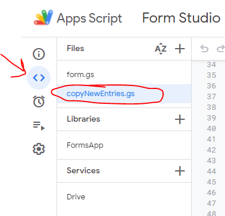
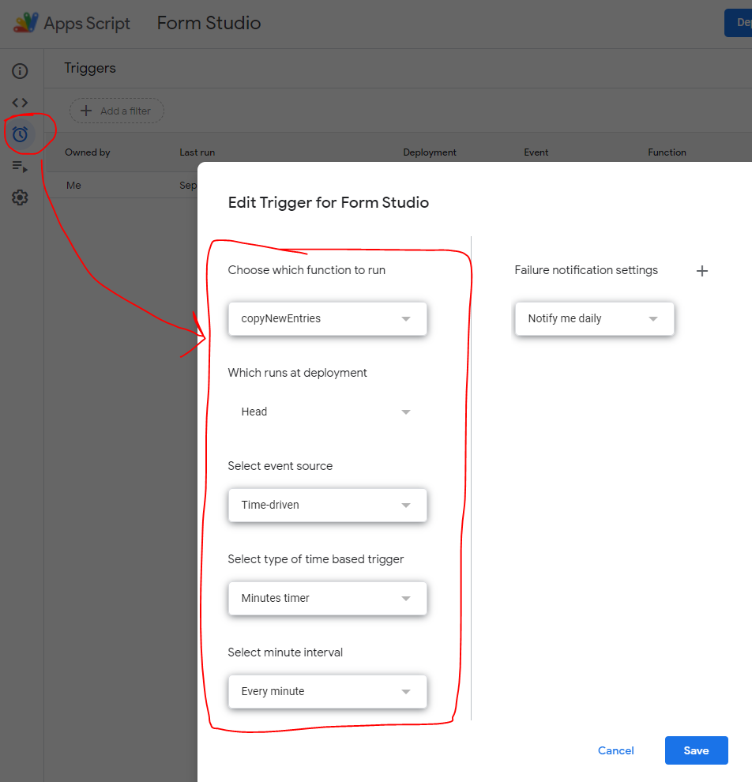

# googleAppScript
A google App Script (JavaScript) to copy and transform entries from one Google sheet to another

## Context
I'm using a Google form written by a third party that sends form fills to my Google Sheet (source sheet). I can't intercept or modify the code that puts the info in that sheet. However, my script, which runs in the Sheet's Google App Script, copies the rows added to the source sheet, then transforms them slightly and puts them into a target sheet. From there I do some other things like have Zapier listen for those newly added rows in the target sheet and take further action.

## How to use
- Place this script as it's own file in the "Files" section of your Google Sheet's App Script. Note that the .gs extension will be added to your filename. I just removed the .js and Google adds .gs when you save the file.

  

- In my case, I setup a timer to run once every minute since I wanted any new rows added to my source sheet to be moved to my target sheet as quickly as possible. At the moment (9/29/2022) Google Sheets doesn't support a way to "listen" to a sheet for changes so a timer is the best option I could find. 

  